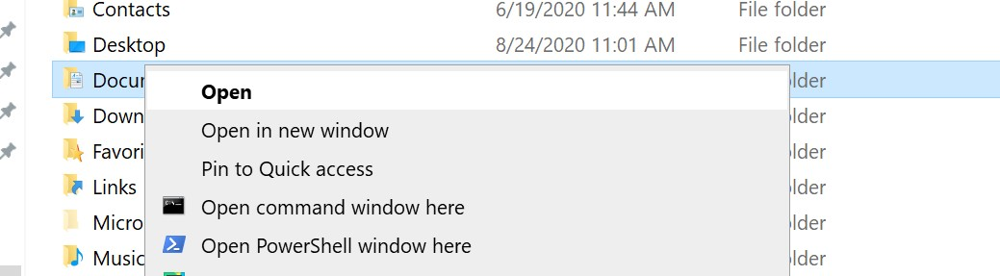

## Overview
Current single click implementation adds two context buttons to open Windows CMD and/or Windows 
Powershell when one performs Right Mouse Click on folder or inside opened folder.

## Quick guide

Clone or download the repository to your local machine.  
Run _set_registry.cmd_ as administrator.

## How it works
SetACL.exe will set owner of _shell_ registry keys to the administrator and grant full access control to keys.  
Next standard Windows registry change is invoked to update registry to add buttons linked to the cmd.exe and 
powershell.exe and their icons